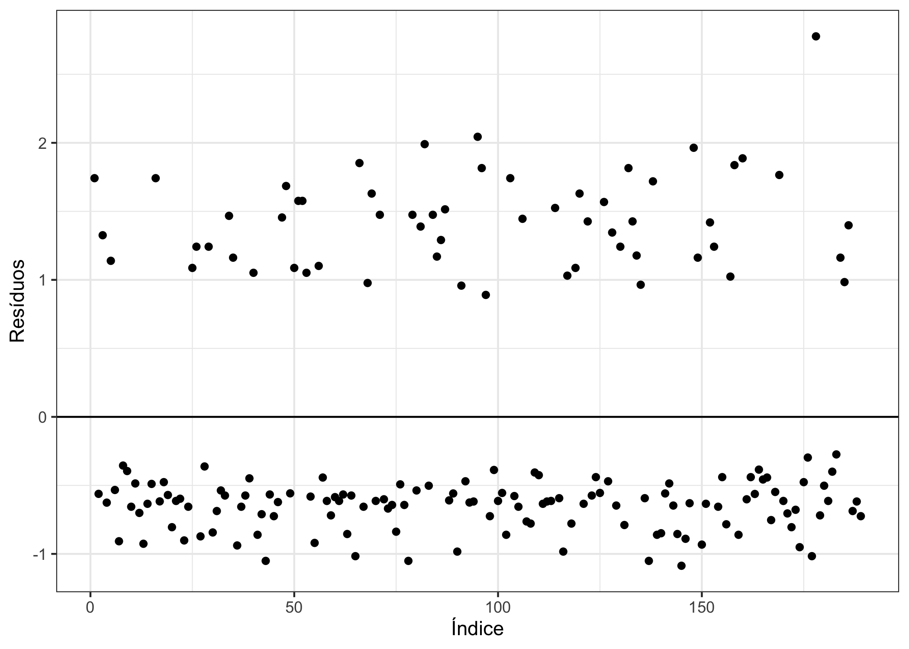

\renewcommand\tablename{Tabela}
\renewcommand\figurename{Figura}


# Introdução 

\justifying
Em muitas situações estamos interessados em analisar o comportamento de uma variável resposta discreta $y$ com relação a um conjunto de covariáveis $\mathbf{X}$. No caso em que $y$ é binária, isto é, a variável $y$ assume o valor $1$ quando ocorre o evento de interesse, que é denominado como "sucesso", e assume o valor $0$ quando não ocorre o evento de interesse, que é denominado "fracasso". Neste caso, podemos utilizar o modelo de regressão logística, o qual estima as probabilidades de ocorrência de um determinado evento de interesse com base nas covariáveis.

Para as análises deste tutorial, utilizaremos o banco de dados **lowbwt** do pacote **aplore3**, que é referente a 189 partos de mulheres numa clínica obstétrica.

# Metodologia

Seja $y_i$ a variável resposta binária e $\mathbf{x}_i = (1, x_{i1}, \ldots, x_{ip})^{\top}$ o vetor de $p$ covariáveis do $i$-ésimo indivíduo ($i = 1, \ \ldots, n$). Seja $\mathbf{X}$ uma matriz $n\times (p + 1)$ da forma $\mathbf{X} = (\mathbf{x}_1, \ldots, \mathbf{x}_n)^{\top}$. Assumimos que $y_i\sim \text{Bernoulli}(\pi_i)$, em que $\pi_i$ é a probabilidade de ocorrência de um determinado evento e desejamos calculá-la a partir das covariáveis preditoras presentes em $\mathbf{x}_i$. Para que os intervalos das probabilidades estimadas permaneçam no intervalo $[0, 1]$, utilizaremos a função de ligação logito. Portanto, a $E[y_i|\mathbf{x}_i]$ pode ser escrita a partir da forma

$$ E[y_i|\mathbf{x}_i] = \pi_i(\mathbf{x}_i) = \frac{e^{g(\mathbf{x}_i)}}{1 + e^{g(\mathbf{x}_i)}}, \quad i = 1, \ldots, n,$$
em que $g(\mathbf{x}_i)$ é o preditor linear da forma 

$$g(\mathbf{x}_i) = \beta_0 + \beta_1 x_{i1} + \beta_2 x_{i2}  + \cdots + \beta_p x_{ip}$$

e $\beta_0, \beta_1, \ldots, \beta_p$ representam parâmetros do modelo. 

## Estimação dos parâmetros

Para estimar o vetor $\boldsymbol{\beta} = (\beta_0, \ \beta_1, \ldots, \ \beta_p)^{\top}$, utilizaremos o método da máxima verossimilhança. Seja $\mathbf{x}_i$ as observações referentes ao $i$-ésimo indivíduo e $\mathbf{y} = (y_1, \ldots, y_n)^{\top}$. Então a função de log-verossimilhança é da forma

$$ \ell\left(\boldsymbol{\beta};\mathbf{X}, \mathbf{y}\right) = \displaystyle\sum_{i = 1}^n \left\{y_ig(\mathbf{x}_i)-\log\left[1 + e^{g(\mathbf{x}_i)}\right]\right\}.$$
Derivando a expressão acima com relação aos parâmetros $\beta_j$,  $j = 1, \ldots, p$, as estimativas dos parâmetros são dadas pela solução simultâneas das equações abaixo, em que $x_{ij}$ representa a $j$-ésima variável do $i$-ésimo indivíduo.

$$ \displaystyle\sum_{i = 1}^n[y_i-\pi_i(\mathbf{x}_i)] = 0\quad \mbox{e}\quad \sum_{i = 1}^nx_{ij}[y_i-\pi_i(\mathbf{x}_i)] = 0, \quad j = 1, \ldots, p.$$

As estimativas dos parâmetros podem ser encontradas a partir de métodos numéricos e denotamos por $\boldsymbol{\hat{\beta}} = \left(\hat\beta_0, \hat\beta_1, \ \ldots, \hat\beta_p\right)$.

Seja $I(\boldsymbol{\beta})$ a matriz de Informação de Fisher de ordem $(p + 1)\times(p + 1)$ da seguinte forma:

\begin{align*}
I_{jj}(\boldsymbol{\beta}) & =  \frac{\partial^2 \ell(\boldsymbol{\beta})}{\beta_j^2} = -\displaystyle\sum_{i = 1}^nx_{ij}^2\pi_i(1-\pi_i), \\
I_{jl}(\boldsymbol{\beta}) & =  \frac{\partial^2 \ell(\boldsymbol{\beta})}{\beta_j\beta_l} = -\displaystyle\sum_{i = 1}^nx_{ij}x_{il}\pi_i(1-\pi_i), 
\end{align*}

para $j, l = 0, 1, \ldots, p$ e $\pi_i = \pi_i(\mathbf{x}_i)$. Podemos obter as variâncias e covariâncias do vetor $\boldsymbol{\hat\beta}$ a partir da inversa da matriz de Informação de Fisher, isto é$,\text{Var}(\boldsymbol{\hat\beta}) = I^{-1}(\boldsymbol{\beta})$. Entretanto, essa quantidade depende de parâmetros desconhecidos, portanto, para resolver esse problema, usaremos a estimativa da variância a partir da estimativa da matriz de Informação de Fisher, logo$,\widehat{\text{Var}}(\boldsymbol{\hat\beta}) = \hat I^{-1}(\boldsymbol{\hat\beta})$. A matriz de Fisher estimada pode ser escrita da forma $\hat I(\boldsymbol{\hat\beta}) = \mathbf{X}^{\top}\mathbf{V}\mathbf{X}$, em que


$$\mathbf{X} = \begin{bmatrix}
1 & x_{11} & \cdots & x_{1p}\\
1 & x_{21} & \cdots & x_{2p}\\
\vdots & \vdots & \ddots & \vdots\\
1 & x_{n1} & \cdots & x_{np}
\end{bmatrix}_{n\times(p + 1)}\quad \mbox{e}\quad \mathbf{V} = 
\begin{bmatrix}
\hat\pi_1(1-\hat\pi_1) & 0 & \cdots & 0\\
0 & \hat\pi_2(1-\hat\pi_2) & \cdots & 0\\
\vdots & \vdots & \ddots & \vdots\\
0 & 0 & \cdots & \hat\pi_n(1-\hat\pi_n)
\end{bmatrix}_{n\times n}.$$

e $\hat\pi_i$ é a estimativa da probabilidade de ocorrência do evento para $i$-ésimo indivíduo. A variância estimada de um determinado $\hat\beta_j$ é encontrada no termo $jj$ da matriz de variâncias estimadas e a covariância entre $\hat\beta_j$ e $\hat\beta_l$ é encontrada no termo $jl$, ou no termo $lj$, já que a matriz é simétrica. Então, o desvio padrão estimado de um determinado coeficiente $\hat\beta_j$ é dado por

$$ \hat\sigma (\hat\beta_j) = \sqrt{\widehat{\text{Var}}(\hat\beta_j)} = \sqrt{\hat I^{-1}_{jj}(\boldsymbol{\hat\beta})}.$$

## Avaliação da significância dos parâmetros

### Teste de Wald

Para testarmos se um único $\beta_j$$,j = 0, \ldots, p$ é igual a zero, ou seja, para testarmos

$$ H_0: \beta_j = 0\quad \mbox{vs}\quad H_1: \beta_j \neq 0$$
a um nível de significância $\alpha, \ 0<\alpha<1$, podemos utilizar a estatística de Wald, definida como

$$ W_j = \frac{\hat\beta_j}{\hat\sigma(\hat\beta_j)}.$$
Sob hipótese nula, essa estatística possui distribuição assintótica qui-quadrado com 1 grau de liberdade. Para valores maiores que o quantil com acumulada igual a $1-\alpha$, rejeitamos $H_0$. Também podemos testar a significância de todo o vetor $\boldsymbol{\beta}$ a partir da seguinte fórmula:

$$ W = \mathbf{\hat\beta}^{\top}\left(X^{\top} VX\right)\mathbf{\hat\beta}.$$
Sob hipótese nula, essa quantidade possui distribuição assintótica qui-quadrado com $p + 1$ graus de liberdade. O critério de rejeição é análogo ao do caso unidimensional.

### Teste da razão de verossimilhança

Para testamos a hipótese de que alguma partição do vetor $\boldsymbol\beta$ de tamanho $k, \ 1\leq k \leq p$, é significativa no modelo, também podemos utilizar a estatística da razão de verossimilhanças, definida por 

$$ G = -2\log (L_S) + 2\log(L_C),$$

em que $L_S$ é a verossimilhança do modelo sem o vetor de interesse e $L_C$ é a verossimilhança do modelo com o vetor de interesse. Sob hipótese nula, essa estatística tem distribuição qui-quadrado com $k$ graus de liberdade e o critério de rejeição é análogo ao teste de Wald.


## Intervalos de Confiança

### Intervalo de confiança para os parâmetros

O intervalo de confiança de um determinado $\beta_j$ com confiança de $100(1-\alpha)\%$ é definido como

$$ IC\left[\beta_j; 100(1-\alpha)\%\right] = \left[\hat\beta_j\mp z_{1-\alpha/2}\hat\sigma(\hat\beta_j)\right],$$

em que $z_{1-\alpha/2}$ é a quantil da distribuição normal padrão cuja probabilidade acumulada é $1-\alpha/2$.

### Intervalo de confiança para o logito das probabilidades

O estimador do preditor linear do $i$-ésimo indivíduo $g(\mathbf{x}_i)$ é pode ser escrito como

$$ \hat g(\mathbf{x}_i) = \mathbf{x}_i^{\top}\widehat{\mathbf{\beta}},$$

e sua variância estimada é definida por

$$ \widehat {\text{Var}}[\hat g(\mathbf{x}_i)] = \mathbf{x}_i^{\top}(\mathbf{X}^{\top}\mathbf{V}\mathbf{X})^{-1}\mathbf{x}_i.$$

Logo, o intervalo de confiança para $g(\mathbf{x}_i)$ com confiança $100(1-\alpha)\%$ é dado por

$$ IC[g(\mathbf{x}_i); 100(1-\alpha)\%] = \left[\hat g(\mathbf{x}_i)\mp z_{1-\alpha/2}\sigma[\hat g(\mathbf{x}_i)]\right]$$

### Intervalo de confiança para os valores ajustados

A partir do intervalo de confiança do logito das probabilidades, podemos encontrar o intervalo de confiança das probabilidades estimadas:


$$ IC[\pi_i; 100(1-\alpha)\%] = \left[\frac{e^{\hat g(\mathbf{x}_i)\mp z_{1-\alpha/2}\sigma[\hat g(\mathbf{x}_i)]}}{1 + e^{\hat g(\mathbf{x}_i)\mp z_{1-\alpha/2}\sigma[\hat g(\mathbf{x}_i)]}}\right].$$


## Análise de Resíduos

### Resíduos de Pearson

Para testarmos a hipótese $H_0:$ "O modelo está bem ajustado" contra $H_1:$ "O modelo não está bem ajustado" podemos utilizar os resíduos de Pearson que, para o $i$-ésimo indivíduo, é definido como

$$ r(y_i, \hat\pi_i) = r_i = \frac{y_i-\hat\pi_i}{\sqrt{\hat\pi_i(1-\hat\pi_i)}}, \quad i = 1, \ldots, n. $$
A partir deles, calculamos a estatística qui-quadrado de Pearson pela fórmula

$$\chi^2 = \displaystyle\sum_{i = 1}^nr(y_i, \hat\pi_i)^2.$$
Sob a hipótese nula, essa estatística segue uma distribuição Qui-quadrado com $n-(p + 1)$ graus de liberdade. O critério de rejeição é análogo ao teste de Wald.


### Resíduos *deviance*

Para testar a mesma hipótese do teste de Pearson, podemos utilizar os resíduos *deviance*, que, para o $i$-ésimo são definidos por

$$ d(y_i, \hat\pi_i) = \pm \left\{2\left[ y_i\log\left(\frac{y_i}{\hat\pi_i}\right) + (1-y_i)\log\left(\frac{1-y_i}{1-\hat\pi_i}\right)\right] \right\}^{1/2}.$$
Sua estatística é dada por sua soma, isto é, 

$$ D = \displaystyle\sum_{j = 1}^n d(y_j, \hat\pi_j)^2.$$

Sob a hipótese nula, a estatística $D$ possui $n-(p + 1)$ graus de liberdade e o critério de rejeição é análogo ao teste de Pearson.

## Predição

Após a estimação das probabilidades de ocorrência, podemos estar interessados em associar um valor estimado para $y$, denotado por $\hat y$, que pode estar de acordo ou não com o valor real. A tabela abaixo mostra a chamada matriz de confusão ou tabela de contigência de um modelo arbitrário.

<style type = "text/css">
.tg  {border-collapse:collapse;border-spacing:0;margin:0px auto;}
.tg td{border-bottom-width:1px;border-color:black;border-style:solid;border-top-width:1px;border-width:0px;
  font-family:Arial, sans-serif;font-size:14px;overflow:hidden;padding:10px 5px;word-break:normal;}
.tg th{border-bottom-width:1px;border-color:black;border-style:solid;border-top-width:1px;border-width:0px;
  font-family:Arial, sans-serif;font-size:14px;font-weight:normal;overflow:hidden;padding:10px 5px;word-break:normal;}
.tg .tg-0pky{border-color:inherit;text-align:left;vertical-align:top}
.tg .tg-pcvp{border-color:inherit;text-align:left;vertical-align:top}
</style>
<table class = "tg">
<thead>
  <tr style = "border-bottom:1px solid black">
    <th class = "tg-0pky"></th>
    <th class = "tg-0pky">ŷ = 0</th>
    <th class = "tg-0pky">ŷ = 1</th>
    <td colspan = "100%"></td>
  </tr>
</thead>
<tbody>
  <tr>
    <td class = "tg-pcvp">y = 0</td>
    <td class = "tg-pcvp">VN</td>
    <td class = "tg-pcvp">FP</td>
  </tr>
  <tr style = "border-bottom:1px solid black">
    <td class = "tg-0pky">y = 1</td>
    <td class = "tg-0pky">FN</td>
    <td class = "tg-0pky">VP</td>
    <td colspan = "100%"></td>
  </tr>
</tbody>
</table>


em que *VN*, *VP*, *FN* e *FP* representam, respectivamente, verdadeiro negativo, verdadeiro positivo, falso negativo e falso positivo. A partir desses quatro valores, podemos definir três conceitos para avaliar se a predição foi boa: a precisão, a sensibilidade e a especificidade.

A **precisão** (ou *accuracy*) mede a proporção de predições corretas, independemente de serem verdadeiros positivos ou negativos.

$$ACC = \frac{VP + VN}{n}$$

em que $n$ é o tamanho da amostra.

A **sensibilidade** (ou *sensitivity*) mede a proporção de verdadeiros positivos, ou seja, a capacidade do modelo classificar como positivo dado que ele é de fato positivo.

$$ SENS = \frac{VP}{VP + FN}.$$

A **especificidade** (ou *specificity*) mede a proporção de verdadeiros negativos, ou seja, a capacidade do modelo classificar como negativo dado que ele é de fato negativo.

$$ SPE = \frac{VN}{VN + FP}.$$

É desejável que essas três quantidades estejam próximas de 1, valores próximos a 0 indicam uma predição não tão boa. Outra medida de avaliar a predição é a partir da curva *ROC* (*Receiver Operating Characteristic Curve*, ou Curva Característica de Operação do Receptor) que gera vários valores e mede sua sensibilidade e 1 menos a sua especificidade, além da área sobre a curva. Valores próximos a 0.5 indicam uma má predição, já valores próximos a 1 indicam uma boa predição.

As fórmulas utilizadas podem ser encontradas em @Hosmer2013 e @silva2016.


# Análise exploratória 

O banco de dados escolhido para este tutorial está presente no pacote **aplore3** e é chamado **lowbwt**. Esse conjunto de dados contém 11 variáveis referentes a 189 partos de mulheres atendidas numa clínica obstétrica e pode ser chamado pelo seguinte comando


```r
library(aplore3)
data(lowbwt)
```
A Tabela abaixo mostra as 4 variáveis de interesse para a regressão logística, sendo **low** a variável resposta, **age** e **lwt** covariáveis preditoras numéricas e **smoke** uma covariável preditora (fator).


|Variável |Significado                                                    |
|:--------|:--------------------------------------------------------------|
|low      |Indicador de peso baixo ao nascer (1: > =  2500g, 2: < 2500g). |
|age      |Idade da mãe em anos.                                          |
|lwt      |Peso da mãe no último período menstrual em libras.             |
|smoke    |Indicador de fumo durante a gravidez (1: Não, 2: Sim).         |


A Figura \@ref(fig:idade) mostra os boxplots das idades das mães pelo peso do bebê. É possível perceber que não há muita diferença entre os dois grupos, indicando que, provavelmente, a idade da mãe não deve ser significativa no modelo.


```r
library(ggplot2)
theme_set(theme_bw())

ggplot(data = lowbwt, aes(x = low, y = age)) + 
  geom_boxplot() + 
  labs(x = "Peso do bebê", y = "Idade")
```

<div class="figure">

<p class="caption">(\#fig:idade)Gráfico da idade pelo peso do bebê ao nascer.</p>
</div>


O segundo gráfico, presente na Figura \@ref(fig:lwt), ilustra os boxplots do peso da mãe em libras pelo peso do bebê ao nascer. É possível perceber que o peso das mães que tiveram filhos mais pesados tende a ser levemente maior.


```r
ggplot(data = lowbwt, aes(x = low, y = lwt)) + 
  geom_boxplot() + 
  labs(x = "Peso do bebê", y = "Peso da mãe (libras)")
```

<div class="figure">

<p class="caption">(\#fig:lwt)\label{fig:lwt} Gráfico da idade pelo peso do bebê ao nascer.</p>
</div>

A tabela a seguir mostra o indicador de se mãe fumou pelo peso do bebê. É possível notar que, dentre as mães que não fumaram, o peso dos bebês tende a ser maior que 2500 g, já dentre as que fumaram, a proporção de bebês mais leves aumenta.


```r
table(lowbwt$smoke, lowbwt$low)
```

```
##      
##       >= 2500 g < 2500 g
##   No         86       29
##   Yes        44       30
```

Transformando todas as variáveis binárias para torná-las variáveis **dummies** (0 para não e 1 para sim). É importante verificar se as variáveis fatores estão realmente como fatores, já que muitas vezes elas aparecem como numéricas. Para isso, é necessário usar o comando **class**, caso elas não estejam, uma das maneiras de transformá-las em fatores é com a função **as.factor**.


```r
class(lowbwt$low)
```

```
## [1] "factor"
```

```r
class(lowbwt$smoke)
```

```
## [1] "factor"
```

```r
levels(lowbwt$low) = c(0, 1)
levels(lowbwt$smoke) = c(0, 1)
```

# Modelagem

## Ajustes

Neste tutorial será mostrado como estimar a probabilidade de um bebê ter um peso menor que 2500 g ao nascer, a partir da idade da mãe, do peso dela no último período menstrual e se ela fumou durante a gravidez. O comando geral para a regressão logística é a partir da função **glm** usando o argumento **family = binomial**, que por *default* usa a função de ligação logito. O primeiro passo será calcular apenas a probabilidade de um bebê nascer com peso baixo a partir da idade da mãe.


```r
(ajuste1 <- glm(low ~ age, family = binomial, data = lowbwt))
```

```
## 
## Call:  glm(formula = low ~ age, family = binomial, data = lowbwt)
## 
## Coefficients:
## (Intercept)          age  
##     0.38458     -0.05115  
## 
## Degrees of Freedom: 188 Total (i.e. Null);  187 Residual
## Null Deviance:	    234.7 
## Residual Deviance: 231.9 	AIC: 235.9
```

Aplicando a função **summary** para verificar a significância do modelo, tem-se


```r
summary(ajuste1)
```

```
## 
## Call:
## glm(formula = low ~ age, family = binomial, data = lowbwt)
## 
## Deviance Residuals: 
##     Min       1Q   Median       3Q      Max  
## -1.0402  -0.9018  -0.7754   1.4119   1.7800  
## 
## Coefficients:
##             Estimate Std. Error z value Pr(>|z|)
## (Intercept)  0.38458    0.73212   0.525    0.599
## age         -0.05115    0.03151  -1.623    0.105
## 
## (Dispersion parameter for binomial family taken to be 1)
## 
##     Null deviance: 234.67  on 188  degrees of freedom
## Residual deviance: 231.91  on 187  degrees of freedom
## AIC: 235.91
## 
## Number of Fisher Scoring iterations: 4
```
Considerando um nível de 5\% de significância, a idade da mãe não influencia no modelo, já que seu p-valor é igual a 0, 105 para testar a hipótese de que o respectivo parâmetro é igual a zero, usando a estatística de Wald. Repetindo o processo com o peso da mãe, tem-se


```r
ajuste2 <- glm(low ~ lwt, family = binomial, data = lowbwt)
summary(ajuste2)
```

```
## 
## Call:
## glm(formula = low ~ lwt, family = binomial, data = lowbwt)
## 
## Deviance Residuals: 
##     Min       1Q   Median       3Q      Max  
## -1.0951  -0.9022  -0.8018   1.3609   1.9821  
## 
## Coefficients:
##             Estimate Std. Error z value Pr(>|z|)  
## (Intercept)  0.99831    0.78529   1.271   0.2036  
## lwt         -0.01406    0.00617  -2.279   0.0227 *
## ---
## Signif. codes:  0 '***' 0.001 '**' 0.01 '*' 0.05 '.' 0.1 ' ' 1
## 
## (Dispersion parameter for binomial family taken to be 1)
## 
##     Null deviance: 234.67  on 188  degrees of freedom
## Residual deviance: 228.69  on 187  degrees of freedom
## AIC: 232.69
## 
## Number of Fisher Scoring iterations: 4
```

Considerando 5\% de significância, a estatística Wald mostra que o peso da mãe é significativo para o modelo ($p = 0.0227$) e possui valor negativo. O terceiro ajuste usa a variável indicadora de fumo da mãe durante o parto.


```r
ajuste3 <- glm(low ~ smoke, family = binomial, data = lowbwt)
summary(ajuste3)
```

```
## 
## Call:
## glm(formula = low ~ smoke, family = binomial, data = lowbwt)
## 
## Deviance Residuals: 
##     Min       1Q   Median       3Q      Max  
## -1.0197  -0.7623  -0.7623   1.3438   1.6599  
## 
## Coefficients:
##             Estimate Std. Error z value Pr(>|z|)    
## (Intercept)  -1.0871     0.2147  -5.062 4.14e-07 ***
## smoke1        0.7041     0.3196   2.203   0.0276 *  
## ---
## Signif. codes:  0 '***' 0.001 '**' 0.01 '*' 0.05 '.' 0.1 ' ' 1
## 
## (Dispersion parameter for binomial family taken to be 1)
## 
##     Null deviance: 234.67  on 188  degrees of freedom
## Residual deviance: 229.80  on 187  degrees of freedom
## AIC: 233.8
## 
## Number of Fisher Scoring iterations: 4
```

Nesse caso, as mães fumantes apresentam uma probabilidade de ter um filho mais leve maior que as não fumantes ($p = 0.0276$). Por fim, será realizado o ajuste com as duas variáveis que foram significativas


```r
ajuste4 <- glm(low ~ lwt + smoke, family = binomial, data = lowbwt)
summary(ajuste4)
```

```
## 
## Call:
## glm(formula = low ~ lwt + smoke, family = binomial, data = lowbwt)
## 
## Deviance Residuals: 
##     Min       1Q   Median       3Q      Max  
## -1.2487  -0.8459  -0.7374   1.2491   2.0808  
## 
## Coefficients:
##             Estimate Std. Error z value Pr(>|z|)  
## (Intercept)  0.62200    0.79592   0.781   0.4345  
## lwt         -0.01332    0.00609  -2.188   0.0287 *
## smoke1       0.67667    0.32470   2.084   0.0372 *
## ---
## Signif. codes:  0 '***' 0.001 '**' 0.01 '*' 0.05 '.' 0.1 ' ' 1
## 
## (Dispersion parameter for binomial family taken to be 1)
## 
##     Null deviance: 234.67  on 188  degrees of freedom
## Residual deviance: 224.34  on 186  degrees of freedom
## AIC: 230.34
## 
## Number of Fisher Scoring iterations: 4
```

A partir dessa saída, pode-se concluir que as probabilidades ajustadas de ter um filho com menor peso terão intercepto nulo ($p = 0.4345$), serão decrescentes conforme o peso da mãe aumenta ($p = 0.0287$) e aumentam se a mãe é fumante ($p = 0.0372$). A seguir, será utilizada a tabela ANOVA com testes da máxima verossimilhança para verificar a significância do modelo completo.


```r
anova(ajuste4, test = "Chisq")
```

```
## Analysis of Deviance Table
## 
## Model: binomial, link: logit
## 
## Response: low
## 
## Terms added sequentially (first to last)
## 
## 
##       Df Deviance Resid. Df Resid. Dev Pr(>Chi)  
## NULL                    188     234.67           
## lwt    1   5.9813       187     228.69  0.01446 *
## smoke  1   4.3500       186     224.34  0.03701 *
## ---
## Signif. codes:  0 '***' 0.001 '**' 0.01 '*' 0.05 '.' 0.1 ' ' 1
```
Considerando ainda um nível de $5\%$ de significância, o modelo com as variáveis **lwt** e **smoke** mostrou-se significativo. É possível também criar um intervalo de confiança para as estimativas a partir da funçaõ **confint**.

```r
cbind(Estimativa = coef(ajuste4), confint(ajuste4))
```

```
## Waiting for profiling to be done...
```

```
##              Estimativa       2.5 %       97.5 %
## (Intercept)  0.62199682 -0.88316262  2.254747549
## lwt         -0.01332433 -0.02607485 -0.002048779
## smoke1       0.67667325  0.04086881  1.317358561
```
Como pode-se perceber, o intervalo de confiança do intercepto contém o número 0, o que corrobora com a evidência de sua nulidade.
A probabilidade de a $i$-ésima mãe ter um filho com peso menor que 2500 g pode ser descrita como

$$\pi (\mathbf{x}_i) = \frac{\exp(-0.0133\times lwt + 0.6767\times smoke)}{1 + \exp(-0.0133\times lwt + 0.6767\times smoke)}.$$


## Análise de Resíduos

O primeiro passo para a análise de resíduos é a obtenção dos resíduos de Pearson para calcular a estatística de Pearson. Na Figura \@ref(fig:resp) é possível perceber que apenas um resíduo teve módulo maior que 2, indicando que, no geral, os resíduos estão bem comportados. Além disso, é possível perceber uma massa de pontos superior a 0, indicando os resíduos das mães que tiveram um filho com peso maior que 2500 g (**low** = 1) e uma segunda massa de pontos, indicando os resíduos das mães que tiveram filho com menor peso (**low** = 0). Entretanto, esse comportamento ocorreu devido à organização do banco de dados. Muitos bancos de dados apresentam resíduos se comportando conforme a Figura \@ref(fig:resp2).


```r
resp <- data.frame(indice = 1:nrow(lowbwt),
                   residuos = residuals(ajuste4, type = "pearson"))

ggplot(resp, aes(x = indice, y = residuos)) +
  geom_point() +
  geom_hline(yintercept = 0) +
  labs(x = "Índice", y = "Resíduos")
```

<div class="figure">

<p class="caption">(\#fig:resp)\label{fig:resp}Gráfico dos Resíduos de Pearson</p>
</div>


```r
ggplot(resp, aes(x = sample(indice), y = residuos)) +
  geom_point() +
  geom_hline(yintercept = 0) +
  labs(x = "Índice", y = "Resíduos")
```

<div class="figure">

<p class="caption">(\#fig:resp2)\label{fig:resp2}Gráfico dos Resíduos de Pearson sem a organização do banco de dados</p>
</div>

O p-valor da estatística qui-quadrado de Pearson para o ajuste do modelo pode ser calculada pelo comando


```r
pchisq(sum(resp$residuos^2), df = ajuste4$df.residual, lower.tail = F)
```

```
## [1] 0.4577639
```

Como a hipótese nula desse teste é de adequação do modelo, considerando um nível de confiança de 5\%, não foi rejeitada tal hipótese, portanto, pode-se garantir que o modelo esteja adequado. Outra forma de teste de ajuste é pelos resíduos *Deviance*. A forma de obtenção é similar à obtenção dos resíduos de Pearson e seu gráfico pode ser visto na Figura \@ref(fig:resd) e, assim como no caso anterior, apenas um resíduo teve módulo maior que 2.


```r
resd <- data.frame(indice = 1:nrow(lowbwt),
                   residuos = residuals(ajuste4))

ggplot(resp, aes(x = indice, y = residuos)) +
  geom_point() +
  geom_hline(yintercept = 0) +
  labs(x = "Índice", y = "Resíduos")
```

<div class="figure">

<p class="caption">(\#fig:resd)\label{fig:resd}Gráfico dos Resíduos Deviance</p>
</div>

O p-valor do teste para os resíduos deviance é realizando também utilizando a função **pchisq**:


```r
pchisq(sum(resd$residuos^2), df = ajuste4$df.residual, lower.tail = F)
```

```
## [1] 0.02873728
```

Nesse caso, considerando um nível de significância de 5\%, a hipótese de adequação do modelo é rejeitada.

## Predição

Para a matriz de confusão é necessário usar a função **predict** e utilizar um critério de separação. Nesse caso, será utilizado 0.3 como critério, ou seja, se a probabilidade ajustada for maior que 0.3, será considerado que tal mãe teve um filho com menor peso, caso contrário, será considerado que tal mãe teve um filho com maior peso.


```r
predicao = predict(ajuste4, type = "response")
table(lowbwt$low, predicao>0.3)
```

```
##    
##     FALSE TRUE
##   0    78   52
##   1    20   39
```

Nesse caso, a especificidade foi de 0.661 e a sensitividade foi de 0.6. Para a curva ROC é necessário utilizar o pacote **pROC** disponível no *CRAN*. A função utilizada é a **plot.roc**, na qual é necessário inserir a variável resposta e os dados ajustados. A Figura \@ref(fig:roc) mostra a curva ROC padrão do pacote e a Figura \@ref(fig:roc2) mostra a curva ROC com algumas alterações visuais. O *AUC: 0.640* representa a área abaixo da curva, que teve um valor baixo, indicando que o ajuste não é muito bom em termos de predição.

```r
library(pROC)
```

```
## Type 'citation("pROC")' for a citation.
```

```
## 
## Attaching package: 'pROC'
```

```
## The following objects are masked from 'package:stats':
## 
##     cov, smooth, var
```

```r
curva_roc <- roc(lowbwt$low, fitted(ajuste4))
```

```
## Setting levels: control = 0, case = 1
```

```
## Setting direction: controls < cases
```

```r
ggroc(curva_roc) +
  labs(x = "Especificidade", y = "Sensitividade")
```

<div class="figure">

<p class="caption">(\#fig:roc)\label{fig:roc} Curva ROC do modelo ajustado</p>
</div>


```r
plot(curva_roc, print.auc=TRUE, auc.polygon=TRUE, grid=c(0.1, 0.2),
      max.auc.polygon=TRUE, auc.polygon.col="cyan",
     xlab="Especificidade", ylab="Sensitividade")
```

<div class="figure">

<p class="caption">(\#fig:roc2)\label{fig:roc2} Curva ROC do modelo ajustado</p>
</div>

\newpage

# Interpretação dos Resultados

O logito do intercepto pode ser entendido como a probabilidade de ocorrência do evento quando todas as covariáveis assumem o valor $0$, mesmo que seja uma variável que o valor zero não faça sentido. No caso do modelo ajustado neste tutorial, seria um caso em que a mãe teria peso $0$ (impossível) e não fumou durante a gestão. Como o intercepto teve valor $0$, portanto, a probabilidade de uma mãe com peso hipotético de $0$ libra e que não fuma seria de

$$\pi(\mathbf{0}) = \frac{\exp(\beta_0)}{1 + \exp(\beta_0)} = \frac{\exp(0)}{1 + \exp(0)} = \frac{1}{2}.$$

Para variáveis numéricas, os coeficientes podem ser interpretados como a modificação no logaritmo da razão de chances ao aumentar em uma unidade o valor dessa variável, ou seja, 

$$\log \left[\frac{\Omega(x_j + 1)}{\Omega(x_j)}\right] = \beta_j,$$

em que $\Omega$ é a chance. Nesse caso, o valor do coeficiente é de -0,0133, ou seja, a razão de chances ao aumentar uma libra no peso da mãe é multiplicada por $\exp(-0.0133) = 0.9868$, ou seja, havendo uma leve diminuição. Para variáveis categóricas, o coeficiente indica uma modificação no logaritmo da razão de chances ao sair de uma categoria para outra, ou seja, 

$$\log \left[\frac{\Omega(x_j = ``A")}{\Omega(x_j = ``B")}\right] = \beta_j,$$

em que $A$ e $B$ indicam, respectivamente, a categoria mostrada na saída do **glm** e a categoria base. Nesse caso, a razão de chances entre o grupo de fumantes e o de não fumantes é de $\exp(0.6767) = 1.9673$, indicando um aumento. A razão de chances pode ser calculada a partir do comando


```r
exp(coef(ajuste4))
```

```
## (Intercept)         lwt      smoke1 
##    1.862644    0.986764    1.967322
```

# Referências


